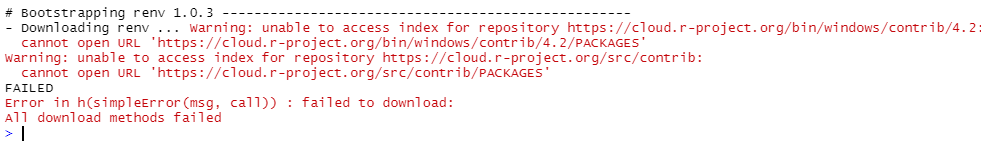
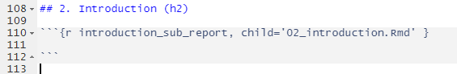

# RAP Skeleton

## :question: What is the RAP Skeleton? 
The RAP Skeleton is a reusable template for RAP projects. It uses the R coding language (written in line with the [tidyverse style guide](https://style.tidyverse.org/)) to create HTML statistical publications. The RAP Skeleton is stored as a repository on the Tech Lab GitHub page and can be accessed by downloading the repository as a ZIP file (Git knowledge is not required for this, see further instructions found below). The RAP Skeleton project contains two sections:  

### Demo
A demo HTML project is included within the RAP Skeleton project. The purpose of the demo is to: 

- View, explore and interact with a demo HTML report.  

- Show the file structure and set-up needed to organise and produce an HTML report. Use the demo to learn more about the `report.Rmd` file as well as the associated `config.R`, `data_prep.R` and `excel_tables.R` files. Each of these files will be prefixed with `demo_` in the demo report (e.g. `demo_config.R`).

- Get inspiration for your own HTML report by viewing examples of elements that can be included and explore the R code used to create them. 

- Learn more about digital accessibility requirements and how they influence the process of coding an HTML report.   

To view the demo HTML report the user must first knit the `demo_report.Rmd` file. Instructions for this procedure will follow further down this document.

### Skeleton template
This is the basis for a user to create their own HTML report. Users can get started by loading their data and adjusting the `config.R`, `data_prep.R` and `excel_tables.R` files before knitting the `report.Rmd` file. 

Users can choose to write all chapters of their report within the `report.Rmd` file or create multiple chapters using extra child `.Rmd` files. These child `.Rmd` files are then called into the `report.Rmd` file and knitted together as one HTML report.  

Note that although the RAP Skeleton template only provides the main `report.Rmd` file, the RAP Skeleton demo HTML is constructed using multiple child `.Rmd` files as different chapters. Users wanting to divide different chapters into multiple child `.Rmd` files should follow the instructions found later in this documentation. 

## Downloading the RAP Skeleton.
In order to work with the RAP Skeleton the project folder must first be downloaded onto your local computer. Follow these steps to complete this process: 

- Download the RAP Skeleton as a ZIP file by clicking on the ‘Source code (zip)’ link under the ‘Assets’ tab on the [latest releases page](https://github.com/NISRA-Tech-Lab/rap-skeleton/releases). The file will be downloaded to the ‘Downloads’ folder on your PC. 

- Open your ‘Downloads’ folder using Windows Explorer and extract the Rap Skeleton contents by right-clicking on the ZIP file and selecting ‘Extract All’.  

- The RAP Skeleton will be contained within a folder with a name such as `rap-skeleton-2.0`. Choose an appropriate location to save this folder e.g. your desktop. 


## Understanding the RAP Skeleton folder structure.
Once downloaded and extracted, you are now able to view the files and folders within the `rap-skeleton-2.0` folder. 
  
Note:  

- `rap-skeleton.Rproj` (rap-skeleton-2.0/rap-skeleton.Rproj) is the main R project file for the Rap Skeleton. Always open this R project file first when working on any element of your report. 

- `report.Rmd` (rap-skeleton-2.0/code/report.Rmd) is the RMarkdown file that will be knitted to produce your HTML report. 

- `demo_report.Rmd` (rap-skeleton-2.0/code/demo/demo_report.Rmd) is the RMarkdown file that will be knitted to produce the demo HTML report. 

- Everything relating to the demo report is stored inside the `demo` folder (`rap-skeleton-2.0/code/demo/`). The entire `demo` folder can be deleted if it is not required. 

The following table lists the RAP Skeleton contents and their purpose:

| Skeleton/Demo | File | Purpose  |
| --- | --- | --- |
| Skeleton | `code/report.Rmd` | RMarkdown report |
| Skeleton | `code/excel_tables.R` | Produce spreadsheet output |
| Skeleton | `code/data_prep.R` | Data prep for report & spreadsheets |
| Skeleton | `code/config.R` | Configuration file primarily for skeleton template (is also read into `demo_config.R`) |
| Skeleton | `data/` | Store your raw data files here |
| Skeleton | `outputs/` | HTML and Excel outputs will be saved here |
| Skeleton | `.gitignore` | A list of files and folders that you wish to be ignored by Git. These will not be uploaded to your Github repo if using one. |
|  |  |  |
| Demo  | `code/demo/demo_report.Rmd`  | Demo RMarkdown report  |
| Demo  | `code/demo/demo_excel_tables.R`  | Produce demo spreadsheet output  |
| Demo  | `code/demo/demo_data_prep.R`  | Data prep for demo report & demo spreadsheets  |
| Demo  | `code/demo/demo_config.R`  | Configuration for demo only  |
| Demo  | `code/demo/demo_data/`  | Raw data for the demo is stored here |
| Demo  | `code/demo/demo_outputs/` | Demo HTML and Excel outputs will be saved here |

## Initialising Renv.
Upon opening the `rap-skeleton.Rproj` file for the first time you may see the following `Renv` warning appear in the console of R studio:



`Renv` is used to lock the current version of the packages within the RAP Skeleton so that any future package updates do not cause any issues with running code. `Renv` only needs to be activated once at the start of each Rap Skeleton project and it will attempt to automatically activate - the above warning is a sign that this automatic activation has failed and must be activated manually. Once `Renv` has been activated manually the above warning will disappear.

To manually activate `Renv`, run the following lines of code one at a time in the console:

- `source("renv/activate.R")`

- `renv::restore()` 

- After running `renv::restore()` press 'y' to accept.

If you did not see the above warning the first time you opened the `rap-skeleton.Rproj` file, it means that `Renv` was able to activate automatically. In this case, there is no need to run `source("renv/activate.R")`. Instead just run `renv::restore()` and press `y` to accept.   

At this stage `Renv` has been activated. For further information visit the [Renv website.](https://rstudio.github.io/renv/index.html)

### Help & Troubleshooting

If the above commands do not appear to work or error message appear, read more about troubleshooting renv in our [R Documentation](https://datavis.nisra.gov.uk/techlab/drpvze/r.html#renv_troubleshooting) 


## What next?
After downloading the RAP Skeleton project, understanding the folder structure and activating `Renv` users can either:    

- Knit the demo HTML report.

or

- Create an HTML report with the RAP Skeleton template.    

It is recommended that first-time users of the RAP Skeleton knit the demo report. This will allow the user to view and interact with an HTML report and give them an idea of what their own report could look like and what elements they can consider including.

## Knit the demo HTML report.
Knitting the `demo_report.Rmd` file will produce the demo HTML report. Follow these steps to produce the demo HTML report:

- Using your Windows file explorer, navigate to the `rap-skeleton-2.0` folder and open it.

-	Double-click the `rap-skeleton.Rproj` file to open the RAP Skeleton R project (`rap-skeleton-2.0/rap-skeleton.Rproj`).

-	Once R Studio has opened the R project, open the `demo_report.Rmd` file by selecting it under the `Files` tab in the bottom right quadrant of R Studio (`code/demo/demo_report.Rmd`).

-	Press ‘knit’ at the top of the `demo_report.Rmd` window (or Ctrl+Shift+K).

After several seconds, the demo HTML report should appear within your R Studio screen. It will also be saved in the `demo_outputs` folder (`code/demo/demo_outputs/`).


## Create an HTML report with the RAP Skeleton template.
Before creating an HTML report with the RAP Skeleton template, users should familiarise themselves with the files and folders associated with RAP Skeleton.
There is not a set workflow for using the RAP Skeleton, however, the following steps are an example workflow that could be suitable for many reports:

- Rename these files and folders to something appropriate E.g. the name of your publication:
    - `rap-skeleton-2.0` (main folder)
    
    - `rap-skeleton.Rproj` (R project file)
    
- Insert raw data files into the `data` folder.

- Open the `.Rproj` file (previously named `rap-skeleton.Rproj`). This will open the project within R Studio.

-	Open the `config.R` file to edit publication metadata. Set the following variables:
    - `nicstheme` (select appropriate department)
    
    - `prerelease` (default = FALSE)
    
    - `bilingual` (default = TRUE)
    
    - `currentyear`
    
    - `title`
    
    - `subtitle`
    
    - `statistic_type`
    
    - `pub_date`
    
    - `next_pub_date`
    
    - `header_publisher` 
    
    - `lead_statistician`
    
    - `header_telephone`
    
    - `header_email` 
    
    - `Excel_Rounding` (default = ‘Yes’)
    
- Open the `data_prep.R` file.
    - Read in your data (view example code for reading in .csv, .xlsx, .sav files and SQL data.)
    
    - Process your data and create data frames.

-	Open the `report.Rmd` file and edit the following:
    - `title` in the YAML

- Write the contents of your report within the `report.Rmd` file and any associated child `.Rmd` files that are called into the `report.Rmd` file.

- Knit the `report.Rmd` file to create the HTML report.

- Open the `excel_tables.R` file if your report requires accompanying Excel tables.

    -	Create and format Excel workbooks (further instructions below). 

- Review HTML and Excel outputs in the `outputs` folder.

Refer to the Dissemination branch advice on [accessibility](https://nicsonline.sharepoint.com/sites/TM-DOF-NISRATEAM/SitePages/DISSEMINATION%20Accessibility.aspx?csf=1&web=1&share=ERUVgIGLxlZHrhT2Qx2TYNwBR9Wz9sVOdzU6s5szFWfKsA&e=pLQycg&CID=8717807a-fbf7-4382-addd-b996ed43e60c) and publishing via the [Datavis server](https://nicsonline.sharepoint.com/sites/TM-DOF-NISRATEAM/SitePages/DISSEMINATION%20Datavis.aspx?csf=1&web=1&share=EReyP93ozeFEozbNJWq3P_kBHxQDUBduy8sGFc335Sx3OA&e=QKW2re&CID=b3035e06-e924-4a4d-b53e-6d44cc99d466).


## Implementing child .Rmd files as individual chapters.
As stated previously, the whole report can be written within the ‘report.Rmd’ file or spread across multiple chapters by using child .Rmd files that are then called into the ‘report.Rmd’ file. If you wish to use child .Rmd files for creating chapters then follow these steps:

- Using Windows file explorer, copy one of the child .Rmd files (e.g. 02_introduction.Rmd) from the ‘demo’ folder into the same folder that contains your main ‘report.Rmd’ file.

- Rename the file to something appropriate.

- Open the child .Rmd file within your R project and edit the title in the YAML.

- Make any other adjustments to the YAML that may be needed e.g set the ‘output_dir’ to the required output destination.

- Edit the set-up chunk to ensure that the correct ‘config.R’, and ‘data_prep.R’ files are sourced along with any other requirements.

- Edit the contents of the chapter beneath the set-up chunk.

- Save the changes to your child .Rmd file and open the ‘report.Rmd’ file which will call in the child .Rmd file.

- To read the child .Rmd file into the ‘report.Rmd’ file follow these steps:

    - Create an h2 level header as a chapter title.
    
    - Create an R code chunk.
    
    - Insert a description for this R code chunk e.g. introduction_sub_report.
    
    - Call in the child .Rmd file e.g. child= ‘02_introduction.Rmd’
    
    - Knit the `report.Rmd` and check output.


Example: 




## Create accompanying Excel tables.
The RAP Skeleton R project contains an R script called ‘excel_tables.R’ which can be used to create accompanying Excel workbooks for your HTML report. Once created, these Excel files are saved in the ‘outputs’ folder.

Creating Excel files involves the following steps within the ‘excel_tables.R’ file:

-	Name the output file by changing the `output_file` variable value from `outputs/excel_tables.xlsx` to a name of your choice e.g. `outputs/economic_report_tables.xlsx`.

- Set `creator` and `title` in the `new_workbook` variable.

- Set fontsize and font in the `modifyBaseFont` variable.

- Set cover sheet info in `df_cover_info` variable.

- Set email address in `email` variable and `names(email)` code.


- Adjust `Contents` page by setting the following variables according to how many sheets and tables your Excel workbook requires:

    - `sheetnames`
    
    - `table_nos`
    
- Set table titles and create a vector of table titles.

- Input text and data under each new table section e.g. `#### Table 1 ####`.

- Adjust information for `Notes Sheet`.

- It is recommended to view and run the `demo_excel_tables.R` file for further information creating accompanying Excel tables.
    
    
## Updating from the Accessibility Template Exemplar 
The previously released Accessibility Template Exemplar has now been superseded by the RAP Skeleton. It is recommended that any reports using the the Accessibility Exemplar as a template are now updated to the RAP Skeleton. Follow the above instructions (Create an HTML report with the RAP Skeleton template) but also take note of these additional points:

- Edit the `config.R` file to set all required variables.

- If your report requires any additional packages then ensure they are added to the package list in the `config.R` file using the `library` function. Also follow these two additional steps in the R Studio console:

    - Run `renv::snapshot()` to update th renv lockfile with your additional packages.
    - Run `renv::restore()` to install any of these additional packages.

- Copy any additional functions that you may have created into the `functions` folder.

- Note that the `header` and `footer` sections in the RAP Skeleton are now created using functions. This content is set via the `config.R` file – there is no need to copy the header HTML code from the Accessibility Template Exemplar into the RAP Skeleton.

- The HTML code at the bottom of the Accessibility Template Exemplar creates download buttons, borders, page banners, the pre-release paragraph and the `tabOrder` function. The RAP Skeleton has these elements already built-in, therefore,  this HTML code does not need to be copied into the RAP Skeleton.

- Copy all data loading and data prep code into the `data_prep.R` file. Bear in mind this no longer has to be written in chunks as in the Accessibility Template Exemplar.

- Copy across the content of the report into the `report.Rmd` file or modularise the report by implementing chapters with child .Rmd files.
    
## Updating to V2 from Rap Skeleton V1
The file structure of RAP Skeleton V2 is identical to V1 and works in a similar fashion. It is recommended that any reports created using V1 are now updated to Rap Skeleton V2.  You should copy your content out of your V1 report and put it into V2 rather than try to pull the additional features from V2 into V1. Follow these basic steps:

- Edit the `config.R` file to set all required variables.

- If your report requires any additional packages then ensure they are added to the package list in the `config.R` file using the `library` function. Also follow these two additional steps in the R Studio console:

    - Run `renv::snapshot()` to update th renv lockfile with your additional packages.
    - Run `renv::restore()` to install any of these additional packages.

- Copy any additional functions that you may have created into the `functions` folder.

- Copy any images needed into the `images` folder.

- Copy all data loading and data prep code into the `data_prep.R` file. 

- Copy across the content of the report into the `report.Rmd` file. If the previous report was created using child `.Rmd` files then copy these files into the correct project folder and ensure they are read in correctly in the new V2 `report.Rmd` file. 
    
## Storing your R project in a Github repository.    
It is recommended that you store the R project for your HTML report in a Github repository. This safeguards your code and allows you to revert to previous versions if required. It also allows other contributors to easily access and update the project code.

#### Git prerequisites
Before attempting to store your R project on Github you must first:

- Ensure your R project folder is named something appropriate (e.g. `01-doj-newpublication`) and is no longer called `rap-skeleton-2.0`.

- Ensure IT Assist have installed 'Git for Windows' on your computer (remembering to install this on all new staff machines and when changing to new machines). 

- Open a Github account online using your work email address.

- Ensure You have run the following configuration codes in the terminal of R Studio, remembering to insert your Github user name and associated email address in the fourth and fifth lines:
```
git config --global http.sslVerify false
git config --global http.proxy http://cloud-lb.nigov.net:8080
git config --global https.proxy https://cloud-lb.nigov.net:8080
git config --global user.name "YourUsername"
git config --global user.email firstname.lastname@nisra.gov.uk
```

#### Create your repository on Github and upload your project
A Github repository must be created first before you can 'push' the contents of your R project up to the repository.

Once the 'Git prerequisites' are completed then follow these steps to create a repository and link your R project:

- In Github.com, create a new repository
  - Name the repository the same name as your R project folder e.g. `01-doj-newpublication`
  - Set repo to private.
  - Do not `Add a README file`.
  - Select `Create repository`.

- Copy the following code, making sure to edit the URL on the fifth line to include the URL of your Github repository: 

```
git init          
git add .         
git commit -m "initial upload"          
git branch -M main                 
git remote add origin https://github.com/your-organisation/name-of-your-repo.git          
git push -u origin main         
```

- Paste this code into the terminal in R studio when you have the R project open and press enter.

- A popup may appear and ask you to sign into Github with your browser. If you get an error try running: `git push -u origin main`

- Refresh your repo on github.com again and you should see all the contents of your R project has now been pushed up to the repo.

- Close your R studio project and re-open again. You should now see a ‘Git’ tab on the top right quadrant of the screen. 


