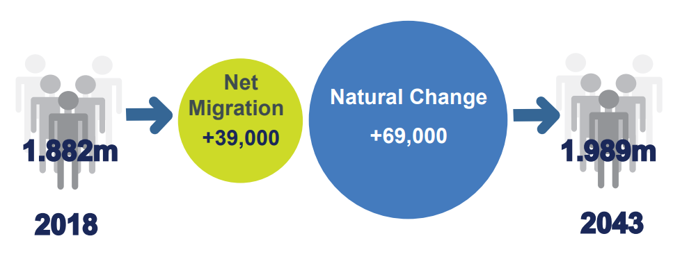

  
  

```{r, include=FALSE}
# this chunk sets chunk options for all chunks in this file
knitr::opts_chunk$set(
  message = FALSE, echo = FALSE
)

library(here)

source(paste0(here(), "/code/config.R"))
source(paste0(here(), "/code/demo/demo_data_prep.R"))
source(paste0(here(), "/code/demo/demo_config.R"))
```


An image should not replace a clear text description so ensure any information presented in an infographic is presented elsewhere. Add alt text for anyone using a screen reader. For more specific guidance about accessible infographics refer to Dissemination Branch document 'Creating an accessible infographic'. For more general guidance you can also refer to [Government Statistical Service (GSS) guidance on infographics](https://gss.civilservice.gov.uk/policy-store/infographics/) but note that as of 20/8/21 it does not include accessibility requirements.

### Type the title of infographic here (h3)

```{r, echo = TRUE, warnings = FALSE, fig.alt = "Population increase from 2018 to 2043 due to relative contributions of natural change and net migration.", out.width="100%"}
# file is in image folder

```

Source: 2019 Mid-year population estimates

