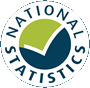

  
  

```{r, include=FALSE}
# this chunk sets chunk options for all chunks in this file
knitr::opts_chunk$set(
  message= FALSE, echo = FALSE
)

library(here)

source(paste0(here(),"/code/config.R"))
source(paste0(here(),"/code/demo/demo_data_prep.R"))
source(paste0(here(),"/code/demo/demo_config.R"))
```

<!-- #natstats link needed here from header-->

```{r national_statistics, echo = FALSE, warnings = FALSE, cap.alt = "The alt text using fig.cap for the NS Logo", fig.alt = "The alt text using fig.alt for the NS Logo"}
#file is in the same directory as the Rcode

```

National Statistics status means that our statistics meet the highest standards of trustworthiness, quality and public value, and it is our responsibility to maintain compliance with these standards.

Population Estimates for Northern Ireland last underwent a full assessment by the Statistics Authority against the [Code of Practice](https://code.statisticsauthority.gov.uk/the-code/) in July 2015. You can view or download the [UK Statistics Authority assessment report pdf (439KB) ](https://www.nisra.gov.uk/sites/nisra.gov.uk/files/publications/UKSA-Assessment-312-2015.pdf). 

Following the Statistics Authority assessment the continued designation of these statistics as National Statistics was confirmed in August 2016 [Assessment Report 312: Population Estimates and Projections for Northern Ireland pdf (119KB)](https://www.nisra.gov.uk/sites/nisra.gov.uk/files/publications/UKSA-designation-2016.pdf). 

National Statistics status was confirmed subject to NISRA implementing six specific requirements. You can see how and when NISRA addressed each of these requirements in the [UK Assessment Action plan pdf (166KB)](https://www.nisra.gov.uk/sites/nisra.gov.uk/files/publications/UKSAAssessment312-ActionPlan.pdf). 

An action plan checklist with supporting documentation are also published online [NISRA's population estimates and projections for Northern Ireland assessment ](https://www.nisra.gov.uk/publications/population-estimates-and-projections-northern-ireland-national-statistics-assessment). Since the assessment by the UK Statistics Authority, we have continued to comply with the [Code of Practice for Statistics](https://code.statisticsauthority.gov.uk), and have made the following improvements:

- improved clarity and insight by redesigning the statistical bulletin to include a key points summary for users
- key point headlines have been included throughout the commentary so users are alerted to key messages
- associated data tables for mid-year population estimates are disseminated in a more innovative way by including a flat file and tabular format which users can interact with
- improved accessibility of mid-year population estimates by publishing data in 3* open data format on Open Data NI
- included a new ‘Links to related statistics’ section within the bulletin so users can explore the whole population statistics package, including older person estimates, population projections, small area population estimates and a range of other material 


